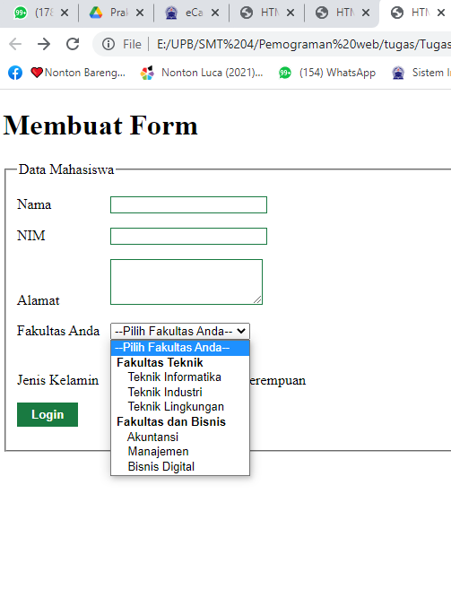

# Lab3Web
## Praktikum 3 : Membuat List, Table, dan Form

### 1. Membuat List
Buatlah dokumen HTML seperti berikut.

Selanjutnya buka pada browser untuk melihat hasilnya.

#### A. Ordered List
Kemudian untuk membuat ordered list gunakan tag `<ol>`.
Lalu didalamnya diisi dengan item-item yang akan dimasukan ke dalam list, item menggunakan tag `<li>`.
Contoh codingannya seperti berikut :

Simpan perubahan yang ada, dan lakukan refresh pada browser untuk melihat hasilnya.

#### B. Unordered List
Kemudian untuk membuat unordered list gunakan tag `<ul>`.
Lalu didalamnya diisi dengan item-item yang akan dimasukan ke dalam list, item menggunakan tag `<li>`.
Contoh codingannya seperti berikut :

Simpan kembali dan refresh kembali browser untuk melihat perubahannya.

#### C. Description List
Kemudian untuk membuat description list ada tiga tag yang digunakan yaitu :
• `<dl>` (description list) tag untuk memulai description list;
• `<dt>` (description term) tag untuk membuat kata yang akan dideskripsikan;
• `<dd>` (description description) tag untuk membuat penjelasan dari kata.

Contoh codingannya seperti berikut :

Simpan kembali dan refresh kembali browser untuk melihat perubahannya.

### 2. Membuat Table
Selanjutnya kita akan membuat table.
HTML Table dapat dibuat dengan tag sebagai berikut :

`<table>` Mendefinisikan sebuah tabel dalam dokumen HTML.
          Atribut: border, cellpadding, cellspacing.
`<thead>` untuk membungkus bagian kepala tabel.
`<tbody>` untuk membungkus bagian body dari tabel.
`<th>` Membuat judul kolom.
`<tr>` Mendefinisikan baris dalam tabel.
       Atribut: align (left, center, right), valign (top, middle, bottom)
`<td>` Mendefinisikan kolom tabel.
       Atribut: align (left, center, right), valign (top, middle, bottom), colspan, rowspan.

Tag yang paling penting untuk diingat adalah tag `<table>`, `<tr>`, dan `<td>`. Sementara tag yang lain
adalah tambahan (opsional), boleh digunakan boleh tidak.

Berikut ini contoh codingan membuat table :

Selanjutnya buka pada browser untuk melihat hasilnya.

#### A. Membuat Margin dan Padding
Untuk mengatur margin dan padding pada cel data, tambahkan atribut cellpadding dan
cellspacing pada tag table.

#### B. Menggabungkan Cell Data
Untuk menggabungkan sel data, gunakan atribut rowspan dan colspan. Atribut rowspan untuk
menggabungkan baris (secara vertikal) dan colspan untuk menggabungkan kolom (secara
horizontal). 

Codingan untuk menggabungkan cell data. 

Simpan dan refresh browser untuk melihat perubahannya.

### 3. Membuat Form
Selanjutnya kita akan membuat form.
Buat file baru seperti berikut :

Kemudian selanjutnya tambahkan kode untuk membuat tabel sederhana seperti berikut:

Buka pada browser untuk melihat hasilnya.

#### A. Menambahkan Style pada Form
Agar tampilan form lebih menarik, bisa ditambahkan CSS seperti berikut.

Simpan dan refresh browser untuk melihat perubahannya.

#### B. Membuat Tampilan Dropdown pada Form
Menu dropdown pada form dibuat menggunakan kombinasi tag `<select>` dan tag `<option>`.

Berikut contoh codingan untuk membuat dropdown :

Kemudian simpan dan refresh kembali browser untuk melihat perubahannya.

#### C. Membuat Tampilan Listbox dengan Multiple Selection pada Form
Untuk menampilkan listbox, tambahkan codingan seperti berikut.

Kemudian simpan dan refresh kembali browser untuk melihat perubahannya.

